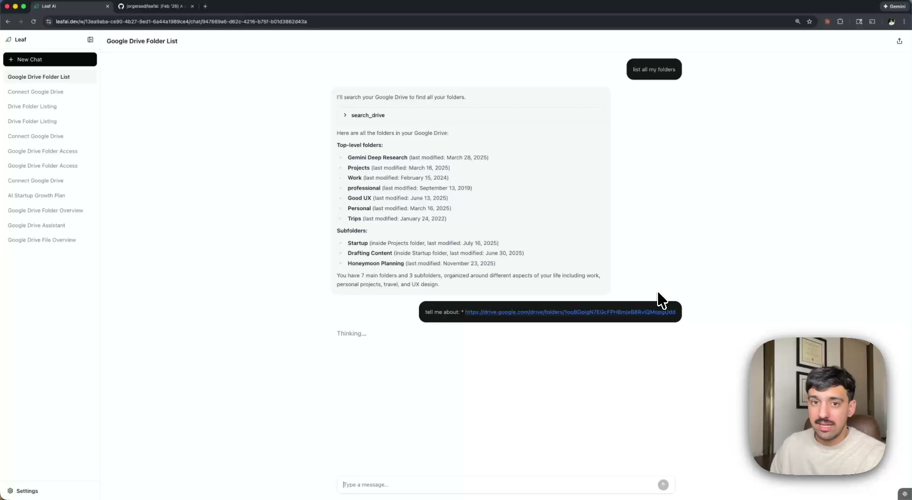

# Leaf AI

<a href="https://www.youtube.com/watch?v=Fz0oH-RWGpQ">
  
</a>

An AI chat application that connects to your Google Drive and lets you have conversations grounded in your own documents. Built with Next.js 16, Supabase, and the Vercel AI SDK.

The AI agent can search, list, and read files from your Drive on-demand — citing sources with links back to the original documents. Conversations run on durable workflows that survive disconnects, deployments, and serverless cold starts.

This project was a deliberate learning exercise — an excuse to get hands-on with technologies I wanted experience with: Bun as a runtime, Vercel deployments and their durable workflow engine, the Google Drive API, and Supabase with row-level security. It also served as a testbed for a [task management system](#agent-task-management--parallelization) I built to coordinate multiple AI coding agents working in parallel on the same codebase.

## Table of Contents

- [Leaf AI](#leaf-ai)
  - [Table of Contents](#table-of-contents)
  - [Features](#features)
  - [Architecture](#architecture)
    - [Chat Workflow](#chat-workflow)
    - [Security Model](#security-model)
  - [Design Decisions](#design-decisions)
  - [Tech Stack](#tech-stack)
  - [Project Structure](#project-structure)
  - [Getting Started](#getting-started)
    - [Prerequisites](#prerequisites)
    - [Quick Start (email/password auth, no Google credentials needed)](#quick-start-emailpassword-auth-no-google-credentials-needed)
    - [Full Setup (with Google OAuth + Drive)](#full-setup-with-google-oauth--drive)
    - [Environment Files](#environment-files)
  - [Commands](#commands)
  - [Agent Task Management \& Parallelization](#agent-task-management--parallelization)
    - [Task structure](#task-structure)
    - [Slash commands](#slash-commands)
    - [The typical workflow](#the-typical-workflow)
    - [Where to look](#where-to-look)

---

## Features

- **Google Drive as context** — the AI agent has tools to search, browse, and read your Drive files during a conversation, citing documents inline
- **Durable chat workflows** — powered by Vercel Workflow Dev Kit; if the user navigates away, closes the tab, or the serverless function cold-starts mid-response, the client automatically reconnects and resumes streaming from the last received token
- **Dual auth** — Google OAuth and email/password via Supabase Auth
- **Per-user workspaces** — auto-created on first login, workspace-scoped sessions and integrations
- **Public chat sharing** — share a read-only snapshot of any conversation via a short link
- **Mobile-first responsive UI** — full-screen menu overlay on mobile, adaptive layout for chat and settings across all screen sizes
- **Streaming SSE** — real-time token-by-token rendering with thinking indicators
- **Auto-generated titles** — LLM generates a concise session title after the first exchange
- **Session management** — delete chat sessions you no longer need directly from the sidebar
- **Row-Level Security** — every table has RLS policies; the database enforces access control independent of application code
- **Comprehensive test coverage** — 131 tests across 23 suites covering API routes, durable workflows, database layer, auth flows, Google OAuth, UI components, and hooks

---

## Architecture

```
┌─────────────────────────────────────────────────────────────────┐
│                      Browser (React 19)                         │
│                                                                 │
│   Login/Signup ──── Sidebar ──── Chat View ──── Settings        │
│   (OAuth+email)    (sessions)   (streaming)   (integrations)    │
└────────┬──────────────┬──────────────┬──────────────┬───────────┘
         │              │              │              │
         ▼              ▼              ▼              ▼
┌─────────────────────────────────────────────────────────────────┐
│                  Next.js 16 App Router (Bun)                    │
│                                                                 │
│  /auth/callback     /api/chat      /api/runs/[runId]            │
│  /auth/actions      POST→workflow  GET→reconnect                │
│                                                                 │
│  /api/integrations/[provider]      /shared/[token]              │
│  connect / disconnect              public read-only view        │
└────────┬──────────────┬──────────────┬──────────────┬───────────┘
         │              │              │              │
    ┌────▼────┐   ┌─────▼──────┐  ┌───▼────┐  ┌─────▼──────┐
    │Supabase │   │  Durable   │  │Google  │  │ OpenRouter │
    │  Auth   │   │  Workflow  │  │Drive   │  │    LLM     │
    │         │   │  Engine    │  │API v3  │  │            │
    │Google   │   │            │  │        │  │Claude      │
    │OAuth +  │   │loadHistory │  │search  │  │Sonnet 4    │
    │email/pw │   │getToken    │  │list    │  │            │
    │         │   │streamAgent │  │read    │  │(via Vercel │
    └────┬────┘   │saveResponse│  │        │  │ AI SDK)    │
         │        └─────┬──────┘  └────────┘  └────────────┘
    ┌────▼──────────────▼─────┐
    │   Supabase PostgreSQL   │
    │                         │
    │  workspaces             │
    │  workspace_members      │
    │  integrations (AES enc) │
    │  chat_sessions          │
    │  chat_participants      │
    │  messages (JSONB parts) │
    │                         │
    │  RLS on every table     │
    └─────────────────────────┘
```

### Chat Workflow

The core of the application is the durable chat workflow. When a user sends a message:

```
User sends message
       │
       ▼
POST /api/chat
  ├─ authenticate user
  ├─ save user message to DB
  ├─ start durable workflow ──────────────────────────┐
  ├─ create pending assistant message                 │
  ├─ schedule title generation (after response)       │
  └─ return SSE stream ◄─────────────────────────┐    │
                                                  │    │
                              Workflow Engine      │    │
                              ┌───────────────────┤    │
                              │ loadHistory        │    │
                              │ getRefreshToken    │    │
                              │ markStreaming       │    │
                              │ runAgent ──────────┘    │
                              │  ├─ streamText()        │
                              │  ├─ tool calls ◄────────┤
                              │  │  (Drive search/      │
                              │  │   list/read)         │
                              │  └─ stream chunks ──► SSE
                              │ saveResponse            │
                              └─────────────────────────┘
```

Each step is durable — if the serverless function cold-starts or the connection drops, the workflow resumes from the last completed step. The client can reconnect via `GET /api/runs/:runId` and pick up where it left off.

### Security Model

```
                    ┌──────────────────────────┐
                    │      Security Layers      │
                    ├──────────────────────────┤
  Request enters ──►│ 1. Middleware             │ Session refresh on every request
                    │ 2. Route auth             │ supabase.auth.getUser() (server-side)
                    │ 3. RLS policies           │ DB enforces row-level access
                    │ 4. App-layer encryption   │ AES-256-GCM on refresh tokens
                    │ 5. Scope separation       │ Login OAuth ≠ Drive OAuth
                    └──────────────────────────┘
```

**Why separate OAuth flows?** Login uses minimal scopes (`openid`, `email`, `profile`) through Supabase Auth. Google Drive access uses a separate OAuth consent with `drive.readonly` scope, initiated from Settings. This means users who never connect Drive never grant API access, and token revocation for Drive doesn't affect their login session.

**Why application-layer encryption?** Even though Supabase provides RLS, refresh tokens are encrypted with AES-256-GCM before storage. If the database is compromised, tokens are useless without the encryption key. Only the refresh token is stored — access tokens are fetched on-demand and never persisted.

---

## Design Decisions

| Decision | Rationale |
|---|---|
| **Durable workflows** over plain streaming | Serverless functions timeout; workflows survive cold starts, deploys, and disconnects without losing progress |
| **JSONB message parts** over normalized tables | Messages store AI SDK-native `parts` (text, tool-call, tool-result) as JSONB — no ORM mapping, direct serialization from the SDK |
| **OpenRouter** as LLM gateway | Single integration point for multiple model providers; easy to swap models without code changes |
| **Workspace-scoped resources** | Sessions, integrations, and members are scoped to workspaces, preparing for future team/shared workspace support without schema changes |
| **DAL pattern** over raw Supabase queries | All DB access goes through `src/lib/db/` modules that handle snake_case→camelCase mapping, encryption, and type safety |
| **Clone-based sharing** | Shared chats are immutable snapshots (cloned sessions), not live links — the original session stays private and editable |
| **Server Components by default** | Only `'use client'` where interactivity is needed; maximizes server rendering and minimizes client JS |

---

## Tech Stack

| Layer | Technology | Notes |
|---|---|---|
| Framework | Next.js 16 (App Router) | Server Components, `after()` callbacks |
| Runtime | Bun | Package manager + runtime |
| Language | TypeScript 5 (strict) | |
| Auth | Supabase Auth | Google OAuth + email/password |
| Database | Supabase PostgreSQL | RLS on every table |
| AI | Vercel AI SDK + OpenRouter | `streamText`, `generateText`, tool calling |
| Durable Workflows | Vercel Workflow Dev Kit | `'use workflow'` / `'use step'` directives |
| Google Integration | `googleapis` | Drive API v3 (search, list, read) |
| UI | Radix UI + Tailwind CSS v4 | |
| Testing | Vitest | 131 tests across 23 suites with coverage reporting |
| Deployment | Vercel | |

---

## Project Structure

```
src/
  app/
    (app)/                          # Protected routes (workspace)
      w/[workspaceId]/              #   Chat, settings
        chat/[chatId]/              #   Individual chat view
        settings/integrations/      #   Google Drive connection
    (auth)/                         # Integration OAuth callbacks
    api/
      chat/                         # POST → start durable workflow
        route.ts                    #   Auth, save message, start workflow, SSE
        workflow.ts                 #   5-step durable workflow
      runs/[runId]/                 # GET → reconnect to in-progress stream
      integrations/[provider]/      # Connect/disconnect integrations
    auth/                           # Supabase callback + server actions
    shared/[token]/                 # Public shared chat view
    login/ signup/                  # Auth pages
  components/
    ui/                             # Radix primitives (button, input, card, ...)
    chat/                           # Message list, bubbles, input, header
    sidebar/                        # Session list, context menus
    integrations/                   # Integration cards
  hooks/
    useChatSessions.ts              # Session CRUD + sidebar state
    useChatStream.ts                # SSE streaming + reconnection
  lib/
    ai/
      agent.ts                      # streamText with Drive tools
      tools.ts                      # list_drive_folder, read_drive_file, search_drive
      prompts.ts                    # System prompts (with/without Drive)
      title.ts                      # Auto-generate session titles
    db/                             # Data Access Layer
      workspaces.ts                 #   get-or-create workspace
      chat-sessions.ts              #   CRUD, sharing, clone
      messages.ts                   #   create, update status, list
      integrations.ts               #   CRUD with transparent encryption
      sharing.ts                    #   Clone-based public sharing
    google/                         # OAuth client, Drive API helpers
    supabase/                       # Client (browser), server, admin, middleware
    crypto.ts                       # AES-256-GCM token encryption
    types.ts                        # Shared TypeScript types (discriminated unions)
  middleware.ts                     # Session refresh + route protection
supabase/
  migrations/                       # SQL: schema, RLS policies, triggers
scripts/
  setup-env.sh                      # Generate .env.local from supabase status
```

---

## Getting Started

### Prerequisites

| Requirement | Install |
|---|---|
| **Bun** | [bun.sh](https://bun.sh) |
| **Docker** | [Docker Desktop](https://www.docker.com/products/docker-desktop/), [OrbStack](https://orbstack.dev/), or colima |
| **Supabase CLI** | `bun add -g supabase` |

### Quick Start (email/password auth, no Google credentials needed)

```bash
bun install
supabase start                  # requires Docker
scripts/setup-env.sh            # generates .env.local
echo 'OPENROUTER_API_KEY=sk-...' >> .env.local   # https://openrouter.ai/keys
supabase db reset               # apply migrations
bun run dev
```

Open `http://localhost:3000`, navigate to `/signup`, and create an account. No email confirmation needed locally.

### Full Setup (with Google OAuth + Drive)

1. In [Google Cloud Console](https://console.cloud.google.com), create OAuth credentials:
   - Authorized JS origins: `http://localhost:3000`
   - Authorized redirect URIs: `http://127.0.0.1:54321/auth/v1/callback` and `http://localhost:3000/auth/integrations/google-drive/callback`
   - Enable the Google Drive API
2. Copy credentials to `.env`:
   ```bash
   cp .env.example .env
   # Edit .env with your GOOGLE_CLIENT_ID and GOOGLE_CLIENT_SECRET
   ```
3. Start everything:
   ```bash
   bun install
   supabase start        # reads .env for Google config
   scripts/setup-env.sh
   supabase db reset
   bun run dev
   ```

### Environment Files

| File | Committed | Purpose |
|---|---|---|
| `.env.example` | Yes | Template for Google OAuth secrets |
| `.env` | No | Actual Google OAuth secrets (read by `supabase start`) |
| `.env.local` | No | Next.js runtime vars — auto-generated by `scripts/setup-env.sh`, add `OPENROUTER_API_KEY` manually |

---

## Commands

```bash
bun install              # Install dependencies
bun run dev              # Start dev server
bun run build            # Production build
bun run lint             # ESLint
bun test                 # Run tests (131 tests, 23 suites)
bun run test:coverage    # Run tests with per-file coverage breakdown

supabase start           # Start local Supabase (Docker)
supabase stop            # Stop local Supabase
supabase db reset        # Reset DB + replay migrations
supabase status          # Show local URLs and keys
```

---

## Agent Task Management & Parallelization

I built a file-based task management system to coordinate multiple AI coding agents working on the same codebase simultaneously. The goal was to keep the pipeline full at all times — while one agent is implementing a feature, others are working on independent tasks in parallel, with explicit rules to prevent conflicts.

This was more formal than my usual workflow, and an experiment in how much structure you need to give agents before they can reliably self-coordinate. For this project I kept all agents on the same branch (no worktrees) and just had them stay aware of each other through the task files — it turned out to work well.

### Task structure

Tasks live as markdown files that move through directories as they progress:

```
docs/tasks/
  todo/                  # Planned tasks waiting to start
  in-progress/           # Currently being worked on
  completed/             # Finished (35 tasks total)
  current-progress.md    # Single-page snapshot of project state
```

Each task file contains structured metadata — dependencies, file ownership, acceptance criteria — plus an append-only progress log:

```markdown
| Field        | Value                                    |
|--------------|------------------------------------------|
| Status       | in-progress                              |
| Agent        | calm-cedar                               |
| Blocked-By   | 20260201142851, 20260201142853            |
| Touches      | src/app/api/chat/, src/lib/ai/agent.ts   |
```

- **Blocked-By** declares dependencies — a task can't start until its dependencies are in `completed/`
- **Touches** declares which files the task will modify — agents check for overlaps before starting to avoid conflicts
- **Progress Log** is append-only with timestamps, creating a full audit trail of decisions and work

### Slash commands

The system is driven by a set of slash commands defined as [Claude Code skills](.claude/skills/) that encode the full workflow. Each command handles all the bookkeeping — timestamps, file moves, metadata updates, `current-progress.md` — so agents stay focused on implementation:

| Command | What it does |
|---|---|
| `/task-create` | Creates a new task file in `todo/`. Surveys existing tasks to avoid duplicates, determines dependencies and file ownership, writes the file with the full template, and updates `current-progress.md`. |
| `/task-start` | Reads the current state of all tasks, summarizes what's ready/blocked/in-progress, and asks which task to pick up. Before starting, it verifies all dependencies are complete, checks for `Touches` overlaps with other in-progress tasks, gathers context from the full ancestor dependency chain, then moves the file to `in-progress/`. |
| `/task-complete` | Reviews acceptance criteria against what was actually delivered, moves the file to `completed/`, writes a final progress log entry, and — critically — scans all remaining `todo/` tasks to see if any are now unblocked and moves them to Ready. |
| `/task-progress` | Reports on a specific task or gives a full system overview: what's in progress, what's ready, what's blocked, and flags issues like stale tasks or overlapping file ownership. |
| `/task-verify` | Audits the entire system for inconsistencies — status/directory mismatches, missing fields, invalid dependency references, stale `current-progress.md` — and fixes them. |
| `/task-e2e` | End-to-end lifecycle — chains create → start → implement → complete into a single session. |

### The typical workflow

Once I got into the hang of things, I created `/task-e2e` which just combined the create, start, and complete skills into one command. The process looks like this:

1. **Create** — I describe what I want built. The agent writes a task file with acceptance criteria, identifies which existing tasks it depends on, and declares which files it will touch.
2. **Start** — The agent walks the full dependency chain (reading ancestor tasks and their outcomes), checks for file ownership conflicts with anything in-progress, then decomposes the task into implementation steps.
3. **Implement** — The agent looks up relevant library documentation, writes tests first (encoding the expected behavior as a runnable spec), then implements against those tests. During implementation it updates its own progress log, and if it discovers significant new work, it creates a separate task in `todo/` rather than expanding scope.
4. **Complete** — The agent verifies all acceptance criteria are met, moves the task to `completed/`, and checks whether any blocked tasks are now unblocked — keeping the pipeline moving.

By the end, implementing features was extremely fast — I'd call `/task-e2e`, describe what I wanted out loud with Willow Voice, my speech-to-text tool, and let the agent handle everything from task creation through completion.

The key was that the structure encourages agents to be disciplined in ways that compound: breaking tasks down into small pieces means more can run in parallel, writing tests first means the acceptance criteria are executable, and tracking file ownership means agents don't step on each other.

The completed task files in `docs/tasks/completed/` serve as a detailed build log — each one captures what was built, in what order, what it depended on, and the decisions made along the way. Reading them chronologically (they're timestamped) gives a full picture of how the project was assembled.

### Where to look

| Resource | Path |
|---|---|
| Task management spec | [`docs/task-management.md`](docs/task-management.md) |
| Slash command definitions | [`.claude/skills/`](.claude/skills/) |
| All completed tasks (41) | [`docs/tasks/completed/`](docs/tasks/completed/) |
| Project status snapshot | [`docs/tasks/current-progress.md`](docs/tasks/current-progress.md) |
| Original design doc | [`docs/design-docs/design-claw.md`](docs/design-docs/design-claw.md) |
| Agent name generator | [`scripts/agent-name.sh`](scripts/agent-name.sh) |
| Worktree creator | [`scripts/create-worktree.sh`](scripts/create-worktree.sh) |

